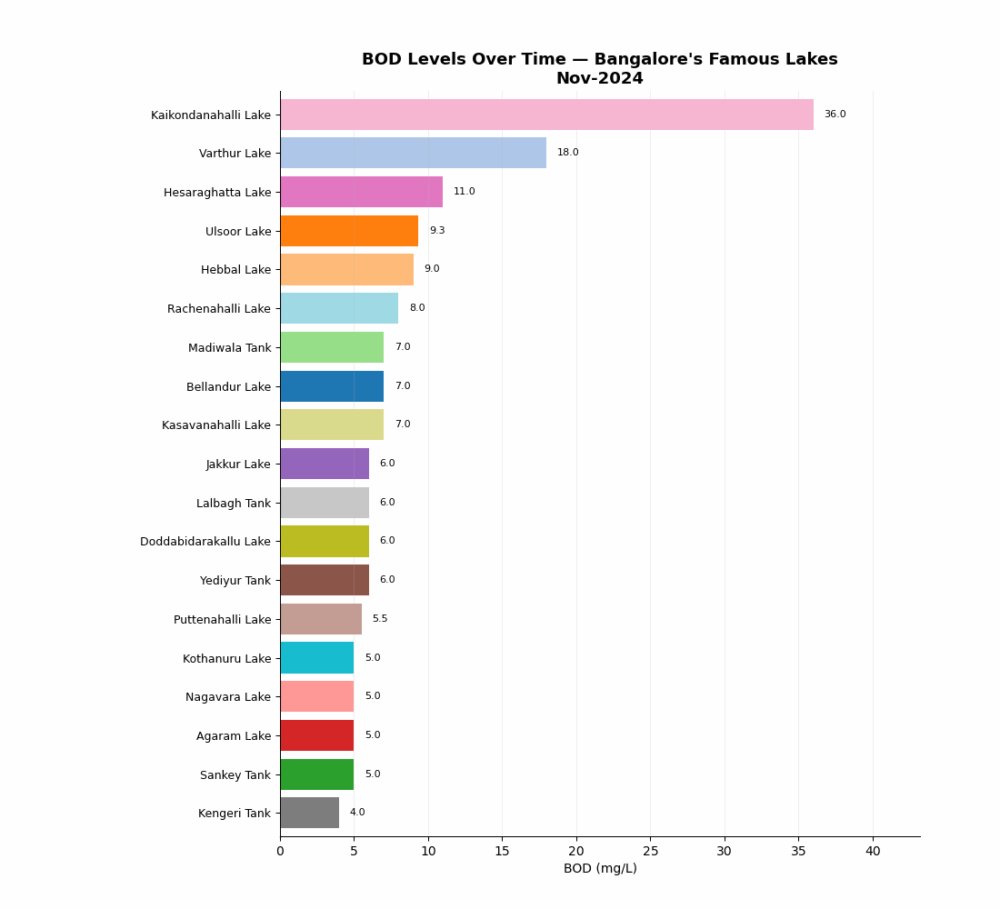
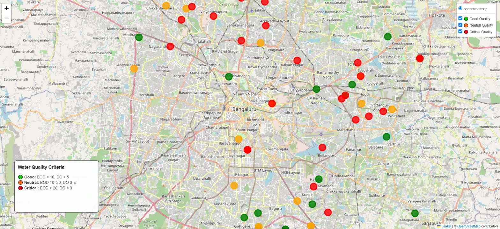
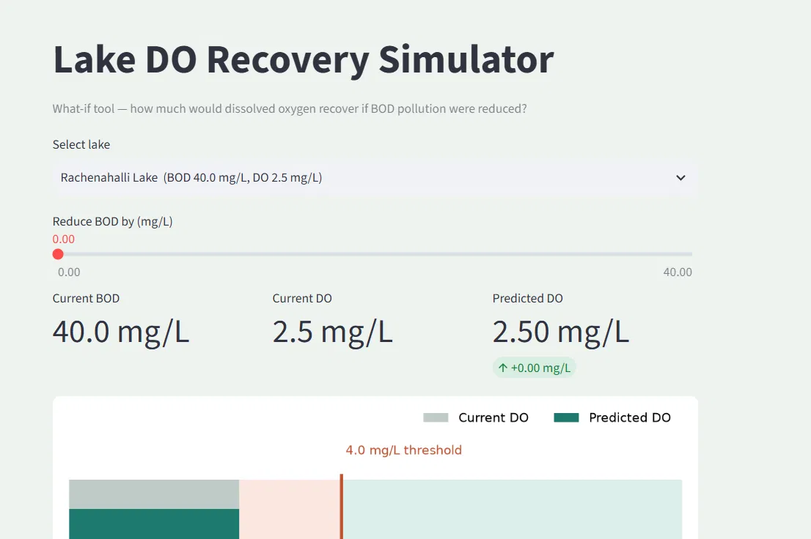
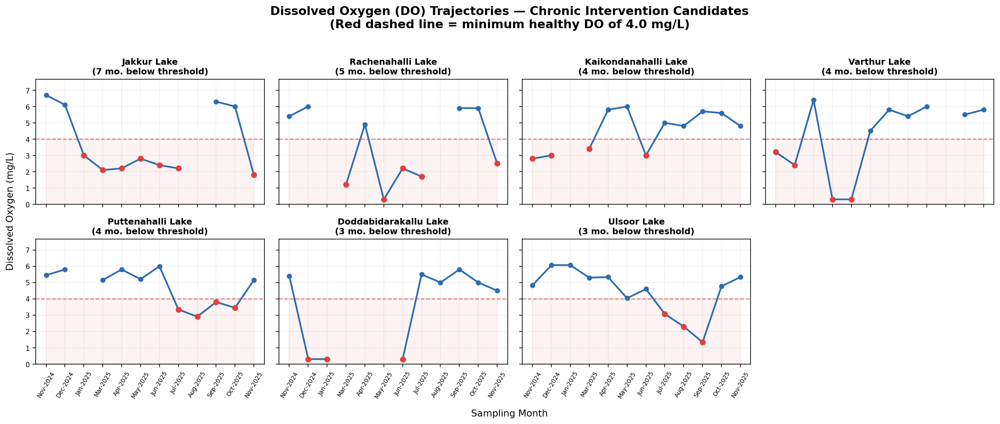

# Bangalore Lakes Water Quality Analysis
**Tracking pollution hotspots across 19 major Bangalore lakes using 13 months of official monitoring data (Nov 2024 – Nov 2025).**

[](https://bangalore-lakes-water-quality-z58p97mdlbwykukh8di2n5.streamlit.app/)


---

## Overview

Bangalore's lakes are under constant pollution pressure, but the official monitoring data — published monthly by the Karnataka State Pollution Control Board (KSPCB) as scanned PDF reports — is hard to use in its raw form. This project turns those PDFs into a clean, analyzable dataset and builds four different views into lake health:

1. **A racing bar chart** ranking lakes by Biochemical Oxygen Demand (BOD) every month, to spot which lakes are chronic pollution hotspots vs. one-off spikes..
2. **An interactive map** plotting every monitored lake by location and current water quality status.
3. **A "what-if" recovery simulator** (Streamlit app) that predicts how much DO would improve if BOD pollution were reduced by a given amount — a simple tool for exploring intervention impact.
4.  **Dissolved Oxygen (DO) trend charts** comparing each lake's oxygen trajectory against the minimum healthy threshold (4.0 mg/L)

## Live Demo
🔗 **[Try the DO Recovery Simulator](https://bangalore-lakes-water-quality-z58p97mdlbwykukh8di2n5.streamlit.app/)**
🗺️ **[Click here to open the live interactive map**](https://nishmapm43.github.io/bangalore-lakes-water-quality/final_dashboard_map.html)

## Key Findings

- **7 of 19 major lakes are chronically oxygen-deficient** — Dissolved Oxygen fell below the healthy minimum (4.0 mg/L) in 3 or more of the 13 months studied. Jakkur Lake was the worst, sitting below the threshold in **7 of 13 months** despite its public reputation as a lake-restoration success story.
- **Lalbagh Tank recorded an isolated BOD spike of 56 mg/L in August 2025** — more than double any other tracked lake that month, flagged as a candidate for follow-up investigation (event-driven pollution vs. sustained decline).
-
## Visuals

### BOD Racing Bar Chart
Watch which lakes stay at the top of the pollution ranking month after month.




### Interactive Lake Map
An interactive Folium map plotting all monitored lakes.



[**🗺️ Click here to open the live interactive map**](https://nishmapm43.github.io/bangalore-lakes-water-quality/final_dashboard_map.html)

### DO Recovery Simulator
A Streamlit what-if tool: select a lake, simulate a BOD reduction, and see the predicted DO recovery against the health threshold.



🔗 **[Try the DO Recovery Simulator](https://bangalore-lakes-water-quality-z58p97mdlbwykukh8di2n5.streamlit.app/)**

### Dissolved Oxygen Trajectories
Each panel shows one chronically low-oxygen lake against the 4.0 mg/L health threshold.



## Data Pipeline

| Stage | Tool |
|---|---|
| Source | KSPCB monthly water quality reports (PDF), Nov 2024 – Nov 2025 |
| Extraction | `pdfplumber` — table extraction from 13 monthly PDF reports |
| Cleaning | `pandas` + `difflib` fuzzy matching to fix fragmented lake names |
| Analysis | `pandas`, `numpy` |
| Static visuals | `matplotlib` (racing bar chart animation, DO trend charts) |
| Interactive map | `folium` |
| Interactive app | `streamlit` |

Final dataset: **1,720 station-month records** across **273 monitoring stations**, mapped to **~140 distinct lakes**, with a curated subset of **19 well-known Bangalore lakes** used for the visualizations above (selected for public recognizability and sufficient monthly data coverage).

## Repository Structure

```
bangalore-lakes-water-quality/
├── README.md
├── requirements.txt
├── master_lakes_final.csv       # cleaned, combined dataset
├── racing_bar_chart.py          # builds the BOD racing bar chart
├── do_trend_analysis.py         # builds the DO small-multiples chart
├── do_recovery_simulator.py     # Streamlit DO Recovery Simulator app
├── bod_race_final.gif
├── do_small_multiples.png
├── final_dashboard_map.html
├── map_preview.png
└── simulator_preview.png
```

## Running Locally

```bash
git clone https://github.com/nishmapm43/bangalore-lakes-water-quality.git
cd bangalore-lakes-water-quality
pip install -r requirements.txt

# Regenerate the static charts
python racing_bar_chart.py
python do_trend_analysis.py

# Launch the interactive simulator
streamlit run do_recovery_simulator.py
```

## Data Source & Limitations

Data is sourced from KSPCB's publicly released monthly lake water quality monitoring reports. As with any government-published monitoring data, coverage is uneven month to month (not every lake is sampled every month — missing months were linearly interpolated for animation purposes only, and are clearly distinguishable from directly measured values in the underlying dataset). This project is intended as a data analysis and visualization exercise, not as an authoritative regulatory source — always refer to KSPCB's original publications for official figures.

## Author

**Nishma Medappa**
[LinkedIn](https://www.linkedin.com/in/nishmapm) [GitHub](https://github.com/nishmapm43)
