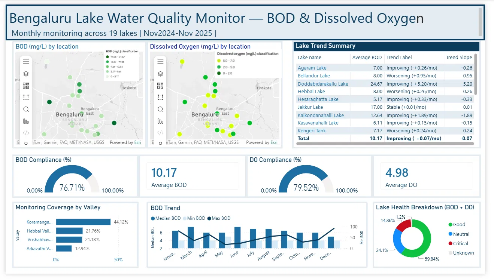
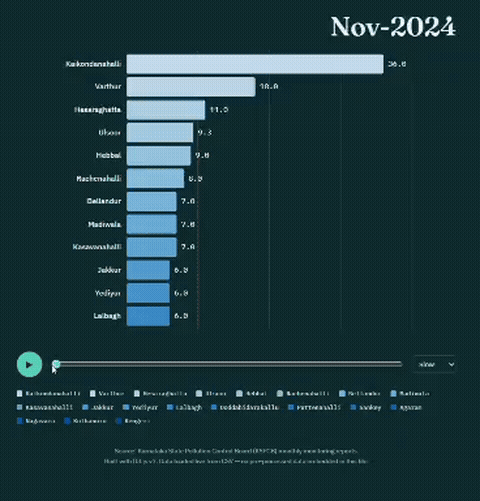

# Bangalore Lakes Water Quality Analysis
**Tracking pollution hotspots across 19 major Bangalore lakes using 13 months of official monitoring data (Nov 2024 – Nov 2025).**


---

## Overview

Bangalore's lakes are under constant pollution pressure, but the official monitoring data — published monthly by the Karnataka State Pollution Control Board (KSPCB) as scanned PDF reports — is hard to use in its raw form. This project turns those PDFs into a clean, analyzable dataset and builds two complementary views into lake health:

1. **A racing bar chart** ranking lakes by Biochemical Oxygen Demand (BOD) every month, to spot which lakes are chronic pollution hotspots vs. one-off spikes.
2. **An interactive Power BI dashboard** combining geographic maps, trend analysis, compliance scoring, and a lake health breakdown — built for at-a-glance monitoring rather than one-time analysis.


## Key Findings

- **7 of 19 major lakes are chronically oxygen-deficient** — Dissolved Oxygen fell below the healthy minimum (4.0 mg/L) in 3 or more of the 13 months studied. Jakkur Lake was the worst, sitting below the threshold in **7 of 13 months** despite its public reputation as a lake-restoration success story.
- **Lalbagh Tank recorded an isolated BOD spike of 56 mg/L in August 2025** — more than double any other tracked lake that month, flagged as a candidate for follow-up investigation (event-driven pollution vs. sustained decline).
- Across all 19 lakes, **76.71% of readings met the safe BOD threshold** and **79.52% met the safe Dissolved Oxygen threshold**, with an overall city-wide trend that was roughly flat to slightly worsening over the 13-month window.
- Classifying every reading into a Good / Neutral / Critical health status shows **59.84% of readings as "Good," 24.10% as "Neutral," and 14.86% as "Critical,"** with a small share (1.20%) flagged as genuine data gaps rather than hidden or dropped.

## Visuals


### BOD Racing Bar Chart
Watch which lakes stay at the top of the pollution ranking month after month.



https://github.com/user-attachments/assets/2d6f92dd-15d9-4aad-9c03-481ba25c495e

### Power BI Dashboard — Bengaluru Lake Water Quality Monitor
An interactive Power BI dashboard tracking BOD and Dissolved Oxygen across all 19 lakes, built for ongoing monitoring rather than a single analysis.


📊 **[Download/open the Power BI dashboard file](https://github.com/nishmapm43/bangalore-lakes-water-quality/blob/main/Bengaluru%20Lake%20Water%20Quality%20Monitor.pbix)**


**What's in the dashboard:**
- **Geographic panels** — two side-by-side maps plotting every lake by BOD and Dissolved Oxygen severity, color-graded (note: for BOD, darker = worse; for DO, higher = healthier — an intentionally opposite color logic worth calling out when presenting this panel).
- **Lake Trend Summary table** — one row per lake, showing average BOD, a plain-language trend label (e.g. "Improving," "Worsening," "Stable"), and the underlying trend slope, computed via a linear regression built from five supporting DAX measures.
- **Compliance gauges** — 76.71% of readings meet the safe BOD threshold (<10 mg/L); 79.52% meet the safe DO threshold (≥4.0 mg/L), cross-verified against an independent Python/pandas calculation on the same underlying dataset.
- **Monitoring Coverage by Valley** — Bengaluru's lakes drain through four interconnected valley systems (Koramangala-Challaghatta, Hebbal, Vrishabhavathi, Arkavathi), a legacy of the city's 16th-century cascading tank network built because Bengaluru has no major river running through it. This panel shows what share of monitoring data comes from each valley.
- **BOD Trend combo chart** — median, min, and max BOD per month layered as bars and lines, answering a city-wide question ("is pollution broadly rising or falling") distinct from the per-lake trend table.
- **Lake Health Breakdown donut** — classifies every reading into Good / Neutral / Critical / Unknown, explicitly surfacing the three genuine data gaps (missing DO readings for specific lake-months) rather than silently dropping them.

## Why This Project
Bengaluru's lakes are under constant pollution pressure, but the data that could actually help track and fix this — monthly water-quality reports from the Karnataka State Pollution Control Board (KSPCB) — is published as scanned PDF documents, not usable datasets. Anyone wanting to understand lake health over time first has to manually read through dozens of PDF reports.

I built a pipeline that turns 13 months of these government PDFs into a single, clean dataset, then used it to answer a simple question:which Bangalore lakes are chronically polluted, which are improving, and which had one-off pollution events worth investigating?

## What I Did
- Extracted water-quality data from 13 monthly KSPCB PDF reports (Nov 2024 – Nov 2025) using `pdfplumber`, pulling out station-level readings for BOD, Dissolved Oxygen, pH, temperature, and more.
- Combined all 13 months into a single dataset — **1,720 station-month records across 273 monitoring stations**.
- Found and fixed a hidden data-quality bug: the PDF-to-text extraction had silently corrupted lake names (e.g. splitting "Karihobanahalli" into "Karihoba" + "-Halli"), fragmenting single lakes into multiple fake entries. Using fuzzy string matching, I merged these duplicates — reducing 174 raw name variants down to ~140 genuinely distinct lakes.
- Built a racing bar chart ranking 19 well-known lakes by pollution (BOD) every month, to separate chronic hotspots from one-off spikes.
- Built an interactive Power BI dashboard (detailed above) for ongoing, at-a-glance monitoring — including a custom DAX-based trend regression, cross-validated compliance metrics, and an explicit data-gap classification.

## What Could Come Next
- Extend the pipeline to automatically ingest new KSPCB monthly reports as they're published, rather than a fixed 13-month window.
- Add a combined Water Quality Index (WQI) score, blending BOD, DO, pH, and temperature into a single status per lake for even faster reading.
- Investigate the Lalbagh Tank August 2025 spike further using rainfall data, to test whether it correlates with runoff events.

## Data Pipeline

| Stage | Tool |
|---|---|
| Source | KSPCB monthly water quality reports (PDF), Nov 2024 – Nov 2025 |
| Extraction | `pdfplumber` — table extraction from 13 monthly PDF reports |
| Cleaning | `pandas` + `difflib` fuzzy matching to fix fragmented lake names |
| Analysis | `pandas`, `numpy` |
| Static visuals | `matplotlib` (racing bar chart animation) |
| Interactive dashboard | Power BI (DAX measures, geographic maps, trend regression) |
| Interactive app | `streamlit` |

Final dataset: **1,720 station-month records** across **273 monitoring stations**, mapped to **~140 distinct lakes**, with a curated subset of **19 well-known Bangalore lakes** used for the visualizations above (selected for public recognizability and sufficient monthly data coverage).

## Repository Structure

```
bangalore-lakes-water-quality/
├── README.md
├── requirements.txt
├── master_lakes_final.csv       # cleaned, combined dataset
├── racing_bar_chart.py          # builds the BOD racing bar chart
├── do_recovery_simulator.py     # Streamlit DO Recovery Simulator app
├── bod_race_final.gif
├── lakepowerbi.png              # Power BI dashboard screenshot
└── Bengaluru Lake Water Quality Monitor.pbix   # Power BI dashboard file
```

## Running Locally

```bash
git clone https://github.com/nishmapm43/bangalore-lakes-water-quality.git
cd bangalore-lakes-water-quality
pip install -r requirements.txt

# Regenerate the racing bar chart
python racing_bar_chart.py


```

Open `Bengaluru Lake Water Quality Monitor.pbix` in Power BI Desktop to explore the dashboard interactively.

## Data Source & Limitations

Data is sourced from KSPCB's publicly released monthly lake water quality monitoring reports. As with any government-published monitoring data, coverage is uneven month to month (not every lake is sampled every month — missing months were linearly interpolated for animation purposes only, and are clearly distinguishable from directly measured values in the underlying dataset). This project is intended as a data analysis and visualization exercise, not as an authoritative regulatory source — always refer to KSPCB's original publications for official figures.

## Author

**Nishma P M**
[LinkedIn](https://www.linkedin.com/in/nishmapm) · [GitHub](https://github.com/nishmapm43)
